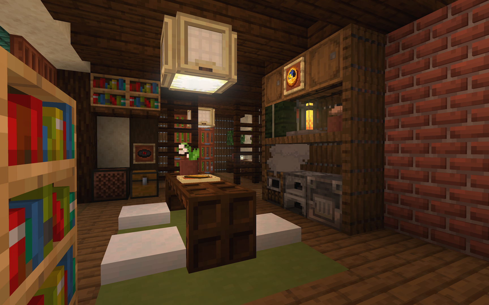
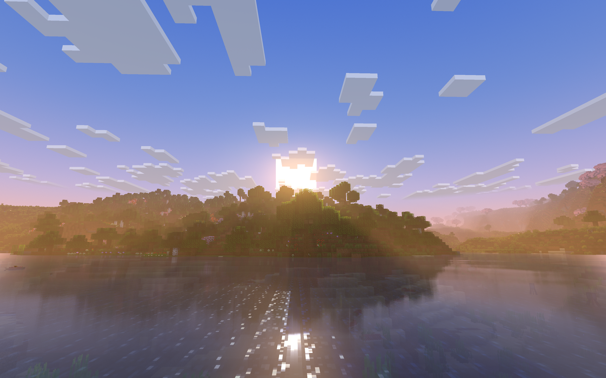
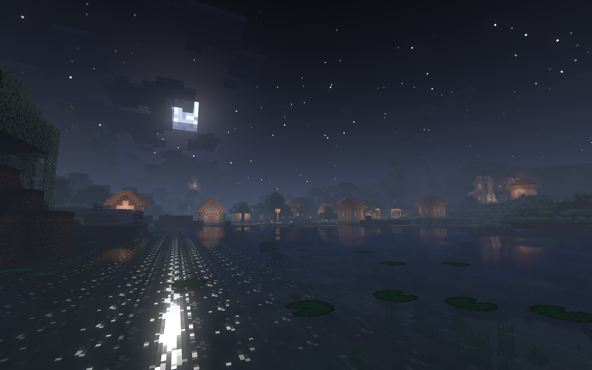
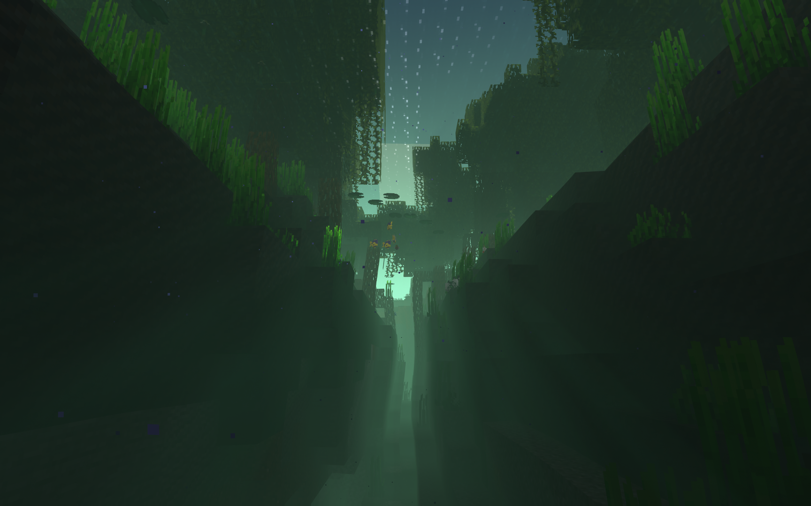
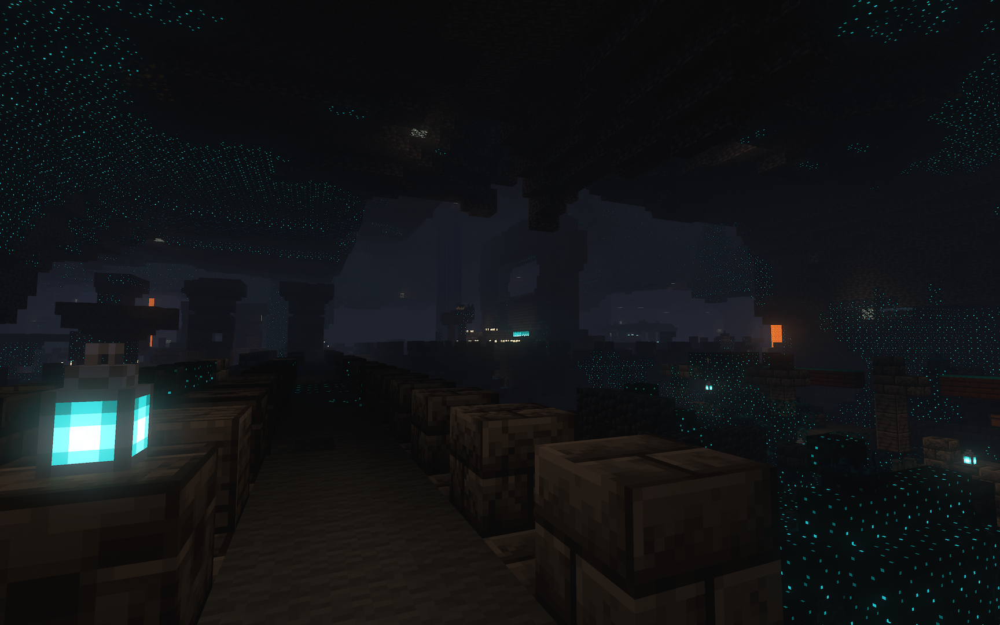
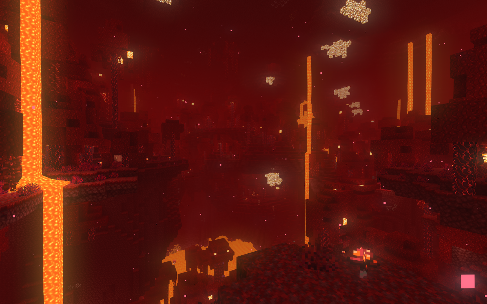
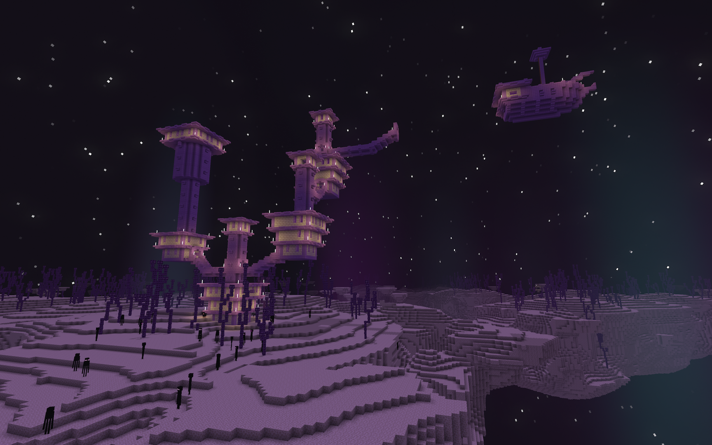

#  Minecraft Blooming Light Shaders

This repository contains a shader pack for **Minecraft** that focuses on stylized visual fidelity while incorporating principles from physically-based rendering (PBR), volumetric lighting, and post-processing. The shader is designed to enhance immersion and atmosphere without compromising Minecraft’s distinct visual identity.

---

## ✨ Features

### ☀️ Lighting

- Reworked ambient lighing
- Direct lighing added with projected shadows
- Custom Ambient occlusion for environmental props
- Pixelated Lighting

### 🧱 Physically-Based Material Rendering

- Emissivness for light sources or luminescent objects
- Reflectance and Roughness to simulate all kind of material (metal, stone, wood, ice, ...)
- Screen Space Reflections (SSR) approximate reflections in real time
- Subsurface Scattering for translucent materials
- Porosity simulates moisture absorption on wet surfaces
- Normal Mapping support through external texture packs or procedurally generated
- Parallax Occlusion Mapping (POM) simulates surface relief using texture height maps

### 🌦️ Atmospheric Effects

- New procedural sky box
- Simulated light shafts with volumetric fog
- Procedural animation of foliage and water surface

### 🎞️ Post-Processing Pipeline

- Temporal Anti-Aliasing (TAA)
- Bloom
- Depth of Field with Bokeh simulation

### 🌍 All Environments

- Surface
- Underwater
- Underground
- Nether
- End

---

## ⚙️ Compatibility

- Minecraft version: `1.21.8`  
- Compatible with: `Iris`
- PBR texture packs: `labPBR`
- Supported Mods: `Distant Horizon`

---

## 📷 Screenshots

---

## Credits

- GLSL noise generator: https://github.com/hughsk/glsl-noise
- Some technical functions came from Complementary shader: https://github.com/ComplementaryDevelopment/ComplementaryReimagined
- Thanks to Samuel Gerkin for his great tutorials: https://www.youtube.com/watch?v=RjyNVmsTBmA
- This project was possible thanks to Iris: https://www.irisshaders.dev
